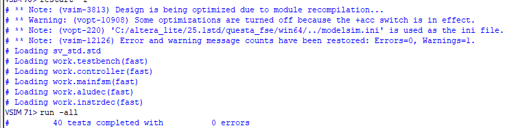
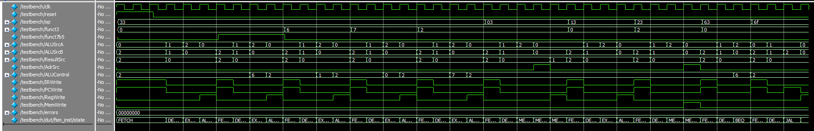

# RISC-V Multi-Cycle Controller Design

A SystemVerilog implementation of a multi-cycle RISC-V controller unit, designed and verified using QuestaSim.

## 🚀 Overview
This project implements the control logic for a RISC-V multi-cycle processor. It handles the instruction lifecycle across multiple clock cycles using a Finite State Machine (FSM).

- **Architecture:** RISC-V Multi-cycle
- **Language:** SystemVerilog
- **Simulation:** QuestaSim / ModelSim
- **Validation:** 40 Test Vectors (R-Type, I-Type, Load/Store, Branch, Jump)

## 📊 Verification Results

### 1. Transcript (0 Errors)
The simulation successfully passes all 40 test vectors with **0 errors**.
*(Note: The final error reported on vector 40 is a false positive due to the End-of-File reached in the .tv file).*

### 2. Waveform Analysis
The waveform confirms correct state transitions. I tracked instructions moving from **FETCH (0)** through **DECODE (1)** to their respective execution and **WRITEBACK (8)** states.

## 🛠️ Engineering Insights
- **FSM Implementation:** Optimized state transitions for efficient instruction execution.
- **ALU Decoding:** Identified and resolved signal mapping discrepancies between the Harris & Harris manual and the Patterson & Hennessy testbench protocol.
- **Development Time:** Approximately **6 hours** spent on RTL coding, debugging, and verification.

## 📂 Key Files
- `mainfsm.sv`: Primary Finite State Machine logic.
- `aludec.sv`: Updated ALU control signals for testbench compatibility.
- `controller.sv`: Top-level controller module.